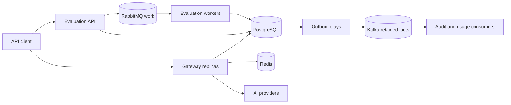

# AegisAI Platform

AegisAI is an original enterprise-style reference implementation of a multi-tenant AI gateway and deterministic response-evaluation platform. It demonstrates explicit distributed-systems correctness in Go without claiming deployment at Citi, another bank, or any production institution.

## Architecture



PostgreSQL is the source of truth. Redis provides atomic short-lived admission controls. Kafka carries retained replayable facts. RabbitMQ carries executable jobs that one worker should complete. Delivery is at least once; idempotent database effects provide correctness.

## Implemented features

- OpenAI-compatible chat-completions subset, including bounded SSE streaming
- Tenant/API-key authentication, scopes, expiry, revocation, and constant-time verification
- Tenant-scoped idempotency with canonical request conflict detection
- Logical requests separated from physical provider attempts
- Explicit request state machine and conditional finalisation
- Deterministic mock provider and OpenAI-compatible HTTP adapter
- Weighted, least-outstanding, EWMA-latency, and priority provider routing
- Concurrency semaphores, cancellation, deadlines, retry jitter, failover, and circuit breaking
- Redis atomic requests/tokens/concurrency limiting per tenant and API key
- PostgreSQL worst-case budget reservations and actual-cost reconciliation
- Integer micro-USD cost accounting with no floating point
- Transactional outbox with `FOR UPDATE SKIP LOCKED`
- Kafka tenant-keyed facts and same-transaction consumer deduplication
- RabbitMQ durable work, confirms, prefetch, manual acknowledgements, TTL retries, DLX, and DLQ
- Deterministic PII, quality, safety, latency, token, and cost evaluators
- Structured JSON logs, Prometheus metrics, Grafana dashboard, and OpenTelemetry propagation
- Docker Compose, secure scratch containers, Helm, HPA, PDB, network policy, and KEDA
- Unit, race, concurrent-invariant, Testcontainers, k6, and failure-injection tests
- Admin CLI, SQL migrations, OpenAPI 3.1 specification, runbooks, ADRs, and interview guide

## Local startup

Requirements: Docker Desktop/Compose v2, or Docker Engine with Compose. WSL2 is recommended on Windows.

```bash
cp .env.example .env
docker compose up --build -d
docker compose ps
```

Compose waits for real dependency health, applies both migrations, seeds a development tenant/key, and then starts services.

Development key:

```text
aegis_devkey0000_0123456789abcdefghijklmnopqrstuvwxyzABCDEFG
```

This credential and the Compose passwords are deliberately local-only.

## Example requests

```bash
export AEGIS_API_KEY='aegis_devkey0000_0123456789abcdefghijklmnopqrstuvwxyzABCDEFG'
api/examples/chat.sh
api/examples/stream.sh
```

Equivalent non-streaming request:

```bash
curl --fail-with-body http://localhost:8080/v1/chat/completions \
  -H "X-API-Key: $AEGIS_API_KEY" \
  -H 'Idempotency-Key: readme-example-001' \
  -H 'Content-Type: application/json' \
  --data '{"model":"aegis-small","messages":[{"role":"user","content":"Explain transactional outboxes."}],"max_tokens":256}'
```

Submit an evaluation after obtaining the logical request ID:

```bash
api/examples/evaluate.sh REQUEST_ID
```

The complete contract is [api/openapi/openapi.yaml](api/openapi/openapi.yaml).

## Developer commands

```bash
make bootstrap
make format
make lint
make test
make test-race
make test-integration
make build SERVICE=gateway
make compose-up
make compose-down
make migrate-up
make seed
make load-test
make helm-lint
make helm-template
```

Without Make on Windows, run the equivalent Go, Docker Compose, and Helm commands from PowerShell or WSL2.

## Admin CLI

```bash
go run ./cmd/admin-cli create-tenant --name='Payments AI' --slug=payments-ai
go run ./cmd/admin-cli create-api-key --tenant=payments-ai --name=gateway-client
go run ./cmd/admin-cli revoke-api-key --id=API_KEY_UUID
go run ./cmd/admin-cli set-budget --tenant=payments-ai --monthly-micro-usd=100000000 --daily-micro-usd=5000000
go run ./cmd/admin-cli inspect-request --tenant-id=TENANT_UUID --id=REQUEST_UUID
```

New API keys are printed once and stored only as keyed hashes.

## Observability

- Gateway metrics: <http://localhost:8080/metrics>
- Prometheus: <http://localhost:9090>
- Grafana: <http://localhost:3000> (`admin` / `admin`, development only)
- RabbitMQ management: <http://localhost:15672> (`aegis` / `aegis`, development only)

See [observability](docs/observability.md) for telemetry fields and suggested alerts.

## Validation

```bash
gofmt -w .
go mod tidy
go vet ./...
go test ./...
go test -race ./...
go build ./...
go test -tags=integration -count=1 ./tests/integration/...
docker compose config
helm lint deployments/helm/aegis-ai
helm template aegis deployments/helm/aegis-ai --namespace aegis-ai
```

The repository never claims a validation command succeeded unless it was executed. Testcontainers and the full Compose stack require a working Docker daemon.
The delivery-specific results are recorded in [docs/validation.md](docs/validation.md).

## Failure testing

```bash
tests/failure/inject.sh stop-provider
tests/failure/inject.sh start-provider
tests/failure/inject.sh kill-worker
tests/failure/inject.sh restart-kafka
tests/failure/inject.sh restart-rabbitmq
tests/failure/inject.sh terminate-gateway-pod
```

See [load testing](docs/load-testing.md) and [failure modes](docs/failure-modes.md).

## Design trade-offs

- Five independently deployable responsibilities share one Go module; package boundaries are not automatically microservices.
- Explicit pgx SQL keeps row locks, unique constraints, and transactions reviewable.
- SSE fits one-way token delivery and ordinary HTTP infrastructure better than WebSockets here.
- Synchronous stream emission applies natural backpressure but makes slow-client timeouts operationally important.
- Tenant-keyed Kafka partitions preserve tenant order but a very hot tenant can concentrate load.
- The gateway reserves against the highest eligible provider price before execution, trading utilisation for budget safety.
- Evaluation is transparent and deterministic; it does not pretend heuristic regex scoring is complete AI safety or DLP.

## Current limitations

- JWT/OIDC validation is an optional production extension; API keys are the implemented authentication mechanism.
- Environment wiring registers one provider by default, while the routing package supports multiple providers.
- The included PII and safety evaluators are illustrative deterministic controls, not compliance-certified scanners.
- Compose is single-node infrastructure for development, not a high-availability topology.
- Multi-region writes, residency routing, institutional secret management, and PostgreSQL row-level security are documented production recommendations.
- Performance thresholds are test examples, not production benchmarks or SLO claims.

## Documentation

- [Architecture](docs/architecture.md)
- [Data model](docs/data-model.md)
- [Security](docs/security.md)
- [Failure modes](docs/failure-modes.md)
- [Observability](docs/observability.md)
- [Local development](docs/local-development.md)
- [Kubernetes](docs/kubernetes.md)
- [Load testing](docs/load-testing.md)
- [Interview story](docs/interview-story.md)
- [ADRs](docs/adr/)
- [Runbooks](docs/runbooks/)

## Roadmap

The reference implementation is feature-complete for its stated scope. Real deployment work would focus on institutional identity, managed multi-region dependencies, compliance controls, performance evidence, provider-specific tokenisation, secret rotation, signed supply-chain artifacts, and recurring disaster-recovery exercises rather than adding more demonstration services.
