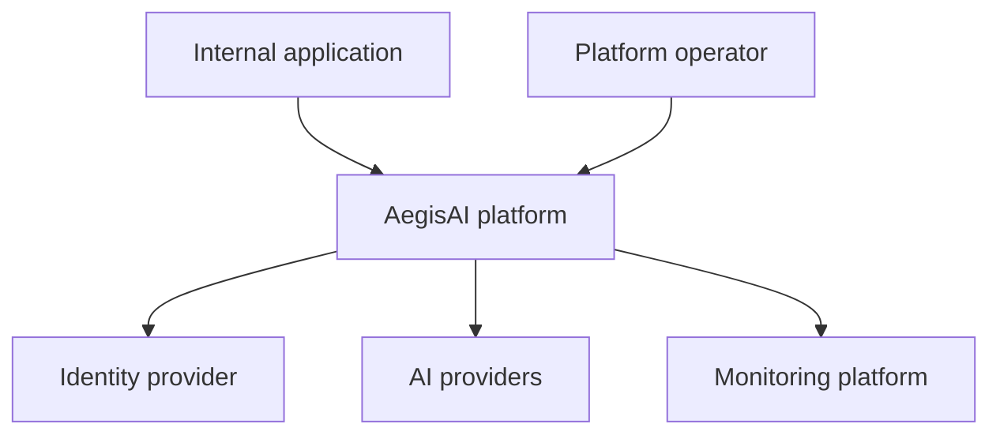
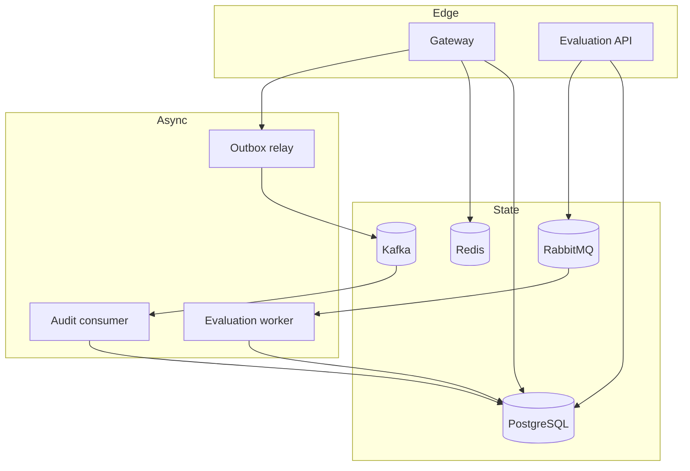
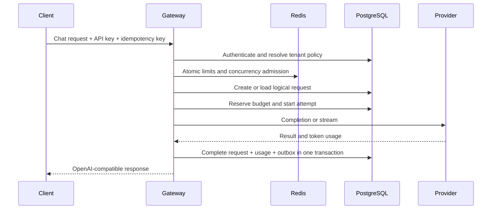
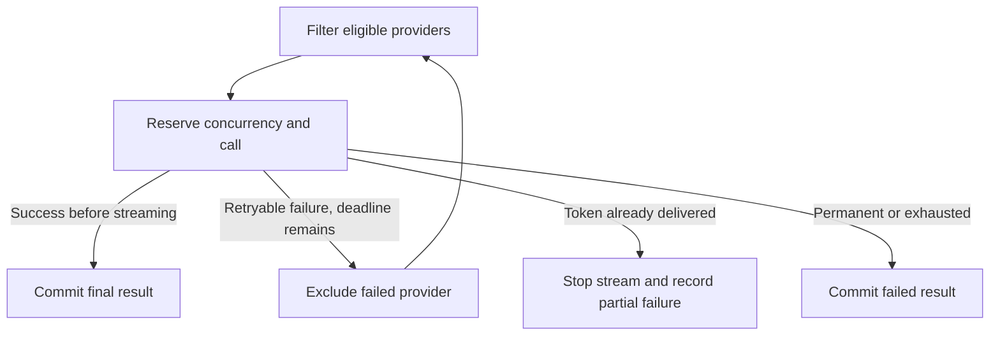
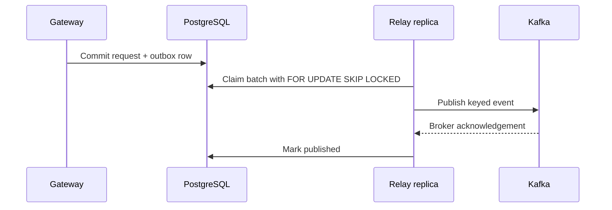
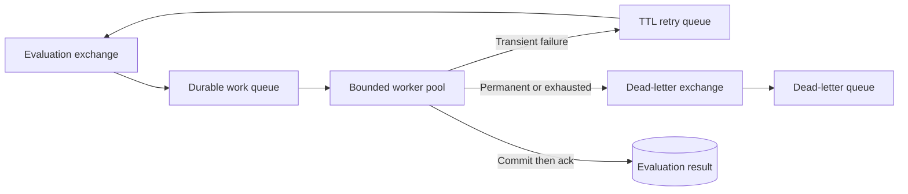

# Architecture

## Context and boundaries

AegisAI gives internal client applications one controlled API for multiple AI providers. The platform owns authentication, tenant policy, logical-request state, usage accounting, audit facts, and response evaluation. Provider model behavior and corporate identity-provider operation remain external concerns.

## Containers

## Primary request sequence

For a repeated idempotency key, the gateway compares a canonical request hash. An identical request returns the existing logical resource; a different request receives `409 Conflict`. The unique constraint on `(tenant_id, idempotency_key)` is authoritative during races.

## Correctness boundaries

| Concern | Mechanism | Authority |
| --- | --- | --- |
| Tenant request uniqueness | Unique tenant/idempotency constraint plus canonical hash | PostgreSQL |
| One final provider result | Conditional request-state update in a transaction | PostgreSQL |
| Concurrent budget admission | Tenant budget row lock and durable reservation | PostgreSQL |
| Per-minute admission | Atomic Redis script | Redis, fail-closed policy configurable |
| Event publication | Completion transaction writes outbox; relay retries | PostgreSQL + Kafka |
| Consumer redelivery | `(consumer_name, event_id)` uniqueness in same effect transaction | PostgreSQL |
| Evaluation redelivery | Unique job and execution identifiers; ack after commit | PostgreSQL + RabbitMQ |

No broker-level exactly-once guarantee is claimed. A crash can cause another delivery; repeated handling is safe by design.

## Provider failover

Locks protect local routing statistics and circuit state but are never held during a network call. Once any token has reached a client, automatic provider switching is forbidden because a second model cannot safely continue the same semantic stream.

## Outbox publication

If the relay crashes after Kafka acknowledges but before PostgreSQL is updated, the event is published again. Consumers therefore deduplicate by event ID. Tenant ID is the default Kafka record key, preserving order for a tenant within one topic partition while allowing different tenants to proceed independently.

## Evaluation retry topology

## Deployment model

Each command is stateless with respect to correctness and can run as multiple replicas. PostgreSQL, Redis, Kafka, and RabbitMQ are external stateful services. Gateway replicas scale on CPU initially; workers scale on RabbitMQ depth; Kafka consumers scale only up to useful partition parallelism.

## Service split

The gateway stays latency-sensitive. Audit projection and response evaluation are asynchronous because they can be retried and scaled separately. The outbox relay is isolated so Kafka availability does not consume gateway request goroutines. This is a small set of process boundaries, not a package-per-concept microservice explosion.
