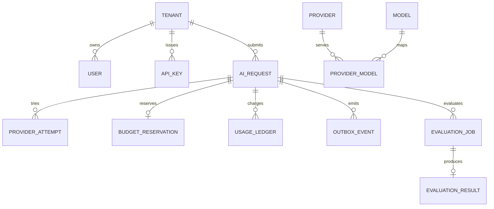

# Data model

PostgreSQL is the system of record. Foreign keys always include a tenant-owning path, and application queries must scope object lookup by authenticated tenant even when IDs are globally unique.

## Ownership and identity

- `tenants` is the root ownership boundary.
- `users` and `api_keys` belong to one tenant. Raw API keys are never stored.
- `models`, `providers`, and `provider_models` describe platform routing inventory.
- Tenant model and provider policies form explicit allow/deny overlays.

## Logical requests and physical attempts

`ai_requests` represents the client-visible operation. Its unique `(tenant_id, idempotency_key)` constraint handles races across gateway replicas. `canonical_request_hash` detects reuse of the same key for different semantic input.

`provider_attempts` records every physical call. `(request_id, attempt_number)` is unique. An application transaction uses a conditional state update before accepting a successful attempt as final.

The request states are `RECEIVED`, `VALIDATED`, `ROUTING`, `IN_PROGRESS`, `COMPLETED`, `FAILED`, `CANCELLED`, and `BUDGET_REJECTED`. Domain code validates transitions; the database enum prevents unknown states.

## Monetary precision

All amounts are signed 64-bit integers measured in micro-USD: one unit is USD 0.000001. Provider prices are stored as micro-USD per one million tokens. Cost calculation uses checked integer arithmetic and documented rounding; floating point is forbidden. This permits sub-cent accounting while retaining a large operating range.

## Budgets and usage

`budget_reservations` is written before a provider call while holding the tenant limit row lock. The transaction sums active reservations and recorded use for the relevant periods, preventing concurrent requests from spending the same remainder. Reconciliation records actual cost and releases unused reservation.

`usage_ledger` is append-only. Its tenant/event uniqueness prevents a replayed Kafka fact from adding a second charge.

## Events

`outbox_events` is committed with the domain change. Multiple relays claim rows with `FOR UPDATE SKIP LOCKED`. A claim is a work-distribution optimization, not the idempotency boundary.

`processed_kafka_events` records `(consumer_name, event_id)` in the same transaction as consumer effects. Different consumers can independently process the same fact; one consumer cannot apply it twice.

`audit_events` and `usage_ledger` are immutable application records. Operational retention should archive rather than update or delete them.

## Evaluations

`evaluation_jobs` uses tenant-scoped idempotency and a canonical hash. `evaluation_results` allows one committed result per job and one result per execution identifier. A RabbitMQ worker commits the result before acknowledging the message, making redelivery safe.

## Index strategy

- Tenant/status/time indexes support scoped request and evaluation lists.
- Partial indexes keep unpublished outbox and pending evaluation scans small.
- Provider attempt indexes support request history and health projections.
- Audit and usage indexes preserve tenant-first access and replay order.
- Secrets and unbounded prompt/response text are intentionally absent from operational indexes.
